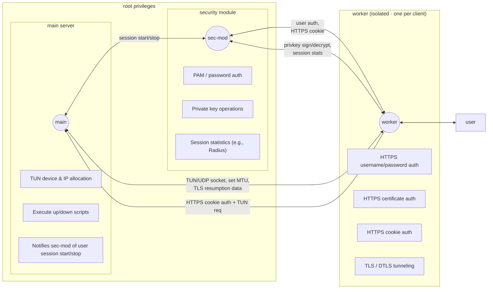
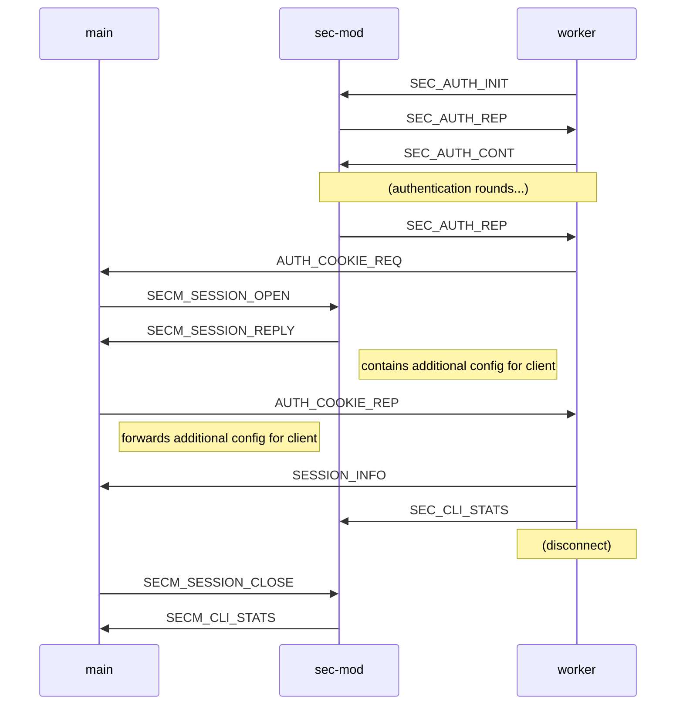
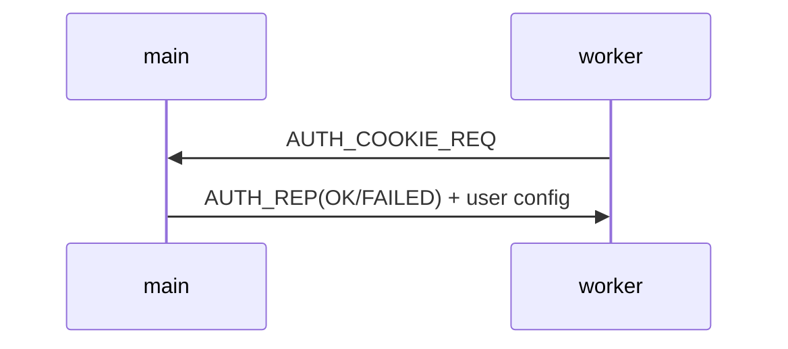
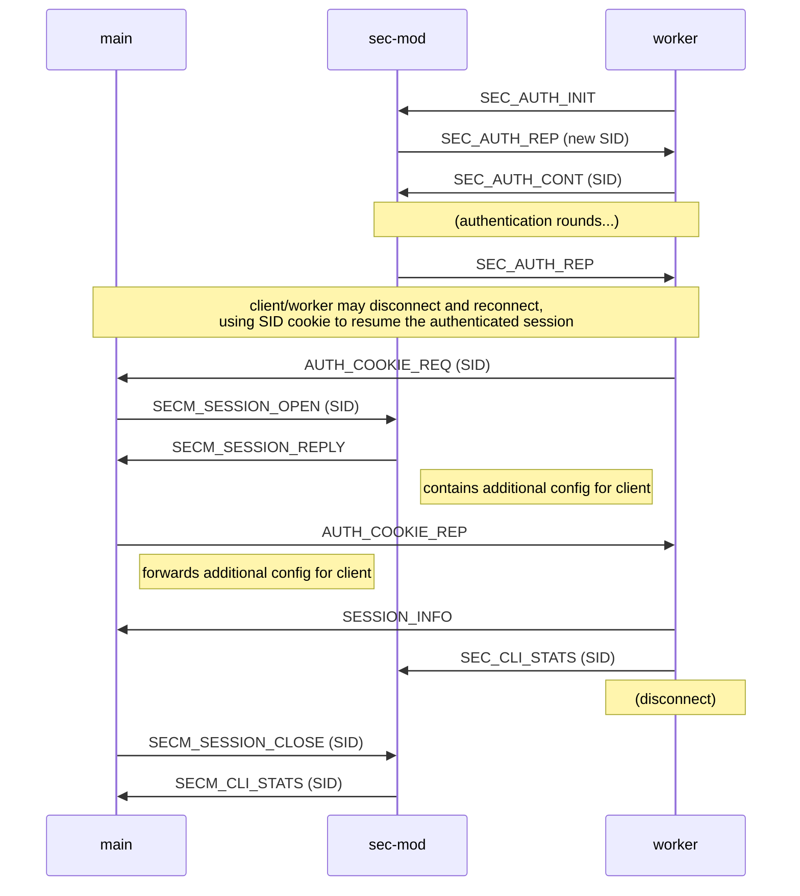

# Intro

To enforce isolation between clients and with the authenticating process,
ocserv consists of 3 components; the main process, the security module and
the worker processes. The following sections describe the purpose and tasks
assigned to each component, and the last section describes the communication
protocol between them.


# VPN overview



## The main process

The main component consists of the process which is tasked to:

 * Listen for incoming TCP connections and fork/exec a new worker process
   to handle it. - See main.c

 * State is passed between main process and worker via an environment
   variable.

 * Listen for incoming UDP "connections" and forward the packet stream
   to the appropriate worker process. - See main.c

 * Create and forward to workers with an authenticated user a dedicated
   tun device. - See AUTH_COOKIE_REQ message handling.

 * Keep track of all connected users. - See the proc_st list in main.h

 * Execute any privileged operations that cannot be handled by worker
    processes (e.g., change the MTU in a tun device) - See main-misc.c

 * Execute any operations that require state for the worker processes,
    e.g., store TLS session data for resumption - See main-misc.c


## The security module process

The security module component consists of a process which keeps all
sensitive data (e.g., private keys, PAM state), that should not be leaked to
a worker process. It is separate from main to ensure that no such data are
leaked during a fork(). It handles:

 * TLS authentication (i.e., private key decryption and signing). That is
   it operates as a 'software security module' for the worker processes to
   use the private key used for TLS without accessing it. - See
   SM_CMD_SIGN/DECRYPT message handling in sec-mod.c.

 * Username/password authentication. That is a worker process needs to
   communicate with the security module the client username/password and
   get a cookie (ticket) to be considered as logged in by the main process.
   The username/password authentication includes GSSAPI authentication.
   For this exchange see the SM_CMD_AUTH_* message handling.

 * Partial certificate authentication. A user certificate received by the
   worker process, is verified by it, and on its SM_CMD_AUTH_INIT message
   it indicates the verification status. The security module approves,
   and performs any other authentication method necessary.

 * Gatekeeper for accounting information keeping and reporting. That is
   currently closely related to radius accounting. The security module
   receives periodically accounting data from the workers and forwards the
   data to the radius accounting server. See the SM_CMD_CLI_STATS message
   handling.

 * Gatekeeper for new user sessions. The security module assigns a session
   ID (SID) to all connecting users. When the main process receives a request
   to resume a session with a SID from a worker process, it will notify the
   security module which keeps the authentication state. The security module
   will return any additional user configuration settings (received via radius
   or per-user config file) - See SM_CMD_AUTH_SESSION_OPEN and SM_CMD_AUTH_SESSION_CLOSE
   message handling.

Currently it seems we require quite an amount of communication between the
main process and the security module. That may affect scaling. If that
occurs it may be possible to exec() the worker process, to ensure there
is no shared memory with main, and transfer some of the sec-mod tasks
directly to main (e.g., accounting information, and remove SESSION_OPEN
and SESSION_CLOSE messages).


## The worker processes

The worker processes perform the TLS handshake, and HTTP exchange for
authentication. After that they simply act as bridge between the tun
device and the client. The tasks handled are:

 * TLS authentication. Perform the TLS key exchange, and when needed verify
   the client certificate.

 * Bridge user authentication with the security module.

 * Forward the cookie received by the security module to main to obtain a
   tun device.

 * Establish a DTLS channel. When a client initiates a UDP session with
   main, that session is connected and forwarded to the worker. The worker
   establishes a DTLS channel over that.

 * Bridge the tun device with the TLS and DTLS channels.


## IPC Communication

* Authentication




* Auth in main process (cookie auth only)




## IPC Communication for SID assignment

This is the same diagram as above but shows how the session ID (SID)
is assigned and used throughout the server.



## Cookies

Cookies are valid for the value configured in `cookie-timeout` option, after
a client disconnects due to timeout. Their purpose is to allow mobile clients to
roam between networks without significant disruption in the VPN service.

## When compile with --enable-latency-stats

The ocserv server gathers statistical data about the latency incurred while processing received DTLS packets. Due to the volume of data being collected, processing is performed in batches. Batch size is a tradeoff of memory usage and statistical accuracy. All values are stored in microseconds (10^-6 seconds).

* Latency samples are first batched by the ocserv-worker, which gathers LATENCY_SAMPLE_SIZE (1024) of latency data.

* After LATENCY_SAMPLE_SIZE samples have been gathered, median, mean and STDEV (RMS of delta from median) are computed for that sample set. Totals are maintained for mean and STDEV as well as count of sample sets processed.

* After more than LATENCY_WORKER_AGGREGATION_TIME (60) seconds have passed (or when the worker process ends) the totals for mean, STDEV and sample count are sent to the main process.

* The ocserv-main process accumulates a running total of mean, STDEV and sample count from all the worker processes for the current sampling interval. Every LATENCY_AGGREGATION_TIME (60s) the current running total is stored as the latency data for the previous interval.

* The main_server_st stats.current_latency_stats stores weighted mean of the latency the server experienced for the last LATENCY_AGGREGATION_TIME interval. Values are stored as total and sample count, permitting the consumer of the stats to better compute confidence interval and mean value for latency and variation of latency.

* Latency information is emitted to the log and can also be queried via occtl. Mean latency for an interval can be computed as latency_median_total/latency_sample_count and mean STDEV can be computed as latency_rms_total/latency_sample_count.

* Latency information can be used as a metric to measure how the ocserv is performing and to measure effective server load.

## Load Balancer integration

Ocserv can be deployed behind a layer 3 load balancer to support high availability and scale.

### Example load balancer configuration using keepalived.
This is not intended as an exhaustive guide to configuring keepalived, but rather as a high level overview.

* One or more hosts (directors) running keepalived, with a virtual IP assigned to them, optionally using VRRP to manage VIP failover (not shown here).

* Three or more instances of ocserv running on hosts (real-server). Virtual IP assigned to the loopback interface with an ARP filter to prevent them from advertising.

* Define a iptables rule to tag incoming traffic to be load balanced:
```
iptables -A PREROUTING -t mangle -d $VIP/32 -j MARK --set-mark 1
```

* Define a keepalived configuration file. Replace IP addresses with the IP of the actual server instances. VRRP configuration not shown here.
```
virtual_server fwmark 1 {
    delay_loop 5
    lb_algo rr
    lb_kind DR
    persistence_timeout 300
    real_server 10.0.0.1 443 {
        TCP_CHECK {
            connect_port 443
            connect_timeout 5
        }
    }
    real_server 10.0.0.2 443 {
        TCP_CHECK {
            connect_port 443
            connect_timeout 5
        }
    }
    real_server 10.0.0.3 443 {
        TCP_CHECK {
            connect_port 443
            connect_timeout 5
        }
    }
}
```

* Set ocserv option "server-drain-ms = 10000" (2 times the health check interval) to permit graceful shutdown of ocserv instances. This setting adds a delay between the time when the server stops accepting new connections (which causes the load balancer to view it as unhealthy) and when existing clients are disconnected. This prevents clients from attempting to reconnect to a server that is shutting down or has recently shutdown.

* Notes on sizing the HA cluster. Best practices for high availability are to maintain a minimum of two spare nodes as this permits for one node to be undergoing maintenance and for an unplanned failure on a second node. Each node should be sized to account for a rapid reconnect of all clients, which will cause a spike of CPU utilization due to TLS key exchange. The rate-limit-ms can be used to flatten the spike at the expense of some clients retrying their connections.
